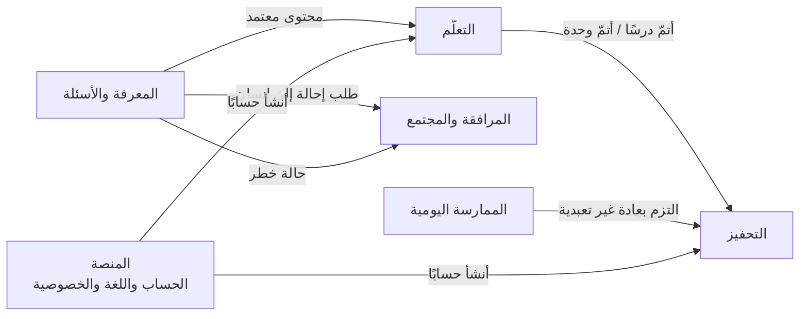

# خريطة المجالات

يتكوّن رفيق من ستة مجالات. لكل مجال غرض واضح، ومصطلحات خاصة به، وقواعد ثابتة، ومالك. **المجال حدٌّ خفيف لا قيد:** يبدع مالكه داخله بحرية، ولا يغيّر ما يملكه مجال آخر إلا بالاتفاق مع مالكه.

## المجالات

| المعرّف | المجال | ما يقدّمه للمستخدم | النوع | المالك |
| --- | --- | --- | --- | --- |
| `LRN` | [التعلّم](domains/learning/README.md) | مسار تعلّم ممتع بأسلوب «دولينجو»: وحدات ودروس قصيرة وتمارين ومراجعة | أساسي | مهند بن صالح الفوزان |
| `MOT` | [التحفيز](domains/motivation/README.md) | سلسلة أيام رحيمة، وأوسمة مراحل، وتحدٍّ جماعي تعاوني، وحالات التفاعل ومؤشراتها، وتذكير لطيف؛ بلا نقاط ولا ترتيب | داعم، مشترك بين المجالات | مهند بن صالح الفوزان |
| `KNW` | [المعرفة والأسئلة](domains/knowledge/README.md) | إجابات موثّقة من المصادر المعتمدة، ومكتبة، وقصص وفوائد، والاستماع إلى القرآن | أساسي، وهو مصدر الثقة | مسلّم بن عبدالعزيز العمير (والمراجعة الشرعية: مهند بن صالح الفوزان) |
| `CMP` | [المرافقة والمجتمع](domains/companion/README.md) | الوصول إلى إنسان، ومرشد يتابعه، ومجموعات صغيرة آمنة | أساسي | يُحدد لاحقًا |
| `PRC` | [الممارسة اليومية](domains/practice/README.md) | مواقيت الصلاة والقبلة، والتقويم الهجري ورمضان، ومتابعة العادات | داعم | ناصر بن خالد العويمر |
| `PLT` | [المنصة](domains/platform/README.md) | البداية واختيار اللغة، والحساب الاختياري، والخصوصية، والإشعارات، ونظام التصميم | عام، يخدم كل المجالات | ناصر بن عبدالعزيز العويمر (ونظام التصميم: ناصر بن خالد العويمر) |

**مؤجَّل:** مجال **الجهات** (`ORG`): رموز الإحالة من الجهات الدعوية، وإدارة المرشدين واعتمادهم، ولوحة متابعة الجهة. يبدأ بعد التحدي.

- **أساسي:** ما يميّز رفيق عن غيره، ويستحق أفضل جهدنا.
- **داعم:** ضروري لتجربة كاملة، لكنه ليس سبب تميّزنا.
- **عام:** خدمات تحتاجها كل المجالات.

## كيف تتواصل المجالات

المجالات لا تقرأ بيانات بعضها مباشرة؛ يُبلغ كل مجال الآخرين بما حدث عنده عبر «أحداث» واضحة.

| الحدث | من | إلى | معناه |
| --- | --- | --- | --- |
| محتوى معتمد | المعرفة والأسئلة | التعلّم | درس أو بطاقة اعتمدها المراجع الشرعي وصارت قابلة للعرض |
| أتمّ درسًا / أتمّ وحدة | التعلّم | التحفيز | تُحدَّث السلسلة وحالة التفاعل وتقدّم التحدي، وتُمنح الأوسمة |
| التزم بعادة غير تعبدية | الممارسة اليومية | التحفيز | تُحتسب في التحفيز. **العادات التعبدية لا ترسل هذا الحدث أبدًا** |
| طلب إحالة إلى إنسان | المعرفة والأسئلة | المرافقة والمجتمع | سؤال شخصي أو لا مصدر له، وطلب المستخدم إنسانًا |
| حالة خطر | المعرفة والأسئلة | المرافقة والمجتمع | أذى أو طرد أو خطر على النفس: يُعرض الدعم البشري فورًا |
| أنشأ حسابًا | المنصة | التعلّم، التحفيز | يُنقل التقدّم المحفوظ على الجهاز إلى الحساب |
| ملخص التعلّم / طلب شرح خطأ | التعلّم | المعرفة والأسئلة | يكتب المساعد رسالة الموجّه التعليمي (LRN-07) أو شرح الخطأ من نص البطاقة وحده (LRN-03)؛ دون هوية، ولا يُحفظ |
| سأل عن هدف | المعرفة والأسئلة | التعلّم | معرّف هدف التعلّم وحده، بإذن المتعلّم، ولا يُرسل للأسئلة الحساسة ولا يحمل نص السؤال (LRN-10) |
| أتمّ مراجعة | التعلّم | التحفيز | أتمّ المستخدم جلسة مراجعة أخطاء (LRN-04)؛ تُحتسب يوم تعلّم وتفاعلًا |
| أتمّ درسًا (إعادة) | التعلّم | التحفيز | إتمام درس أتمّه المستخدم من قبل، معلَّمًا بأنه إعادة (LRN-02) |
| حصل على وسام | التحفيز | المرافقة والمجتمع | وسام جديد؛ يراه المرشد فقط إن أذن المستخدم بمشاركة تقدّمه (MOT-03) |
| تغيّرت حالة التفاعل | التحفيز | المرافقة والمجتمع | حالة المستخدم الجديدة؛ يراها المرشد فقط إن أذن المستخدم بمشاركة تقدّمه (MOT-07) |
| انضم إلى مجموعة / غادر مجموعة | المرافقة والمجتمع | التحفيز | عضوية المجموعة للتحدي الجماعي (MOT-06). **الاسمان مقترحان، يُتفق عليهما مع مالك المرافقة والمجتمع** |

## قواعد بين المجالات

- كل مجال يملك بياناته، ولا يعدّلها غيره.
- القواعد المشتركة (الضوابط الشرعية، والخصوصية، وقواعد التحفيز) مكتوبة مرة واحدة في [agents/rules.md](agents/rules.md)، وتسري على الجميع.
- ميزة تمس مجالين تُكتب في المجال الذي يملك قرارها، وتذكر الحدث الذي تحتاجه من المجال الآخر.
