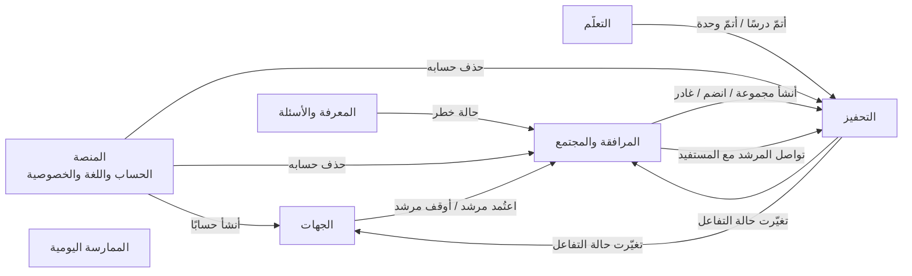

# خريطة المجالات

يتكوّن رفيق من ستة مجالات. لكل مجال غرض واضح، ومصطلحات خاصة به، وقواعد ثابتة، ومالك. **المجال حدٌّ خفيف لا قيد:** يبدع مالكه داخله بحرية، ولا يغيّر ما يملكه مجال آخر إلا بالاتفاق مع مالكه.

## المجالات

| المعرّف | المجال | ما يقدّمه للمستخدم | النوع | المالك |
| --- | --- | --- | --- | --- |
| `LRN` | [التعلّم](domains/learning/README.md) | مسار تعلّم ممتع بأسلوب «دولينجو»: وحدات ودروس قصيرة وتمارين ومراجعة | أساسي | مهند بن صالح الفوزان |
| `MOT` | [التحفيز](domains/motivation/README.md) | سلسلة أيام رحيمة، وأوسمة مراحل، وتحدٍّ جماعي تعاوني، وحالات التفاعل ومؤشراتها، وتذكير لطيف؛ بلا نقاط ولا ترتيب | داعم، مشترك بين المجالات | مهند بن صالح الفوزان |
| `KNW` | [المعرفة والأسئلة](domains/knowledge/README.md) | إجابات موثّقة من المصادر المعتمدة، ومكتبة، وقصص وفوائد، والاستماع إلى القرآن | أساسي، وهو مصدر الثقة | مسلّم بن عبدالعزيز العمير (والمراجعة الشرعية: مهند بن صالح الفوزان) |
| `CMP` | [المرافقة والمجتمع](domains/companion/README.md) | الوصول إلى إنسان، ومرشد يتابعه، ومجموعات صغيرة آمنة | أساسي | يُحدد لاحقًا |
| `PRC` | [الممارسة اليومية](domains/practice/README.md) | مواقيت الصلاة والقبلة، والتقويم الهجري ورمضان، ومتابعة العادات | داعم | ناصر بن خالد العويمر |
| `PLT` | [المنصة](domains/platform/README.md) | البداية واختيار اللغة، والحساب الاختياري، والخصوصية، والإشعارات، ونظام التصميم | عام، يخدم كل المجالات | ناصر بن عبدالعزيز العويمر (ونظام التصميم: ناصر بن خالد العويمر) |

ومجال سابع داعم: **[الجهات](domains/organizations/README.md)** (`ORG`): رموز الإحالة من الجهات الدعوية، وإدارة المرشدين واعتمادهم، ولوحة متابعة الجهة. كان مؤجَّلًا إلى ما بعد التحدي، ثم بُني (ORG-01..03، PR #32)؛ ومالكه يُحدد لاحقًا.

- **أساسي:** ما يميّز رفيق عن غيره، ويستحق أفضل جهدنا.
- **داعم:** ضروري لتجربة كاملة، لكنه ليس سبب تميّزنا.
- **عام:** خدمات تحتاجها كل المجالات.

## كيف تتواصل المجالات

المجالات لا تقرأ بيانات بعضها مباشرة؛ يُبلغ كل مجال الآخرين بما حدث عنده عبر «أحداث» واضحة.

الجدول يذكر كل حدث يُرسل اليوم في الكود (`publish(...)` في `backend/app/*`) ومن يستقبله فعلًا (`@subscribe`). وما لا مستقبل له يُقال ذلك صراحة.

| الحدث | من | إلى | معناه |
| --- | --- | --- | --- |
| محتوى معتمد (`ContentApproved`) | المعرفة والأسئلة | المعرفة والأسئلة وحدها (فهرس بطاقات الفريق، KNW-02) | أكّد المراجع الشرعي نسخة في مكتب المراجعة (KNW-05). **لا مستقبل له في التعلّم:** المحتوى المدمج يُعرض مباشرة (`rules.md` §1.4، 2026-10-06)، والتعلّم يسأل عند كل طلب عمّا يُعرض (`published()` في `backend/app/knowledge/review.py`) |
| أتمّ درسًا / أتمّ وحدة | التعلّم | التحفيز | تُحدَّث السلسلة وحالة التفاعل وتقدّم التحدي، وتُمنح الأوسمة |
| التزم بعادة غير تعبدية | الممارسة اليومية | — | **لا يُرسل** (قرار PRC-02، اعتمده مالك المنتج 2026-10-06): لا شيء في التحفيز يستقبله، وإرساله يُخرج من الجهاز بيانًا عن عادات المستخدم؛ فيبقى العدد على الجهاز. والعادات التعبدية لا ترسل هذا الحدث أبدًا |
| طلب إحالة إلى إنسان (`EscalationRequested`) | المعرفة والأسئلة | المرافقة والمجتمع (يتجاهله) | يُرسل آليًا كلما أحال المساعد إلى إنسان (سؤال شخصي أو حساس، أو رد ثابت معه «أريد إنسانًا»). **لا تُنشئ منه المرافقة طلبًا:** الطلب لا يوجد إلا حين يضغط المستخدم «أريد إنسانًا» (`backend/app/companion/events.py`) |
| حالة خطر (`DangerDetected`) | المعرفة والأسئلة | المرافقة والمجتمع | أذى أو طرد أو خطر على النفس: يُعرض الدعم البشري فورًا، ويصير طلبًا عاجلًا في كل صندوق (CMP-01) |
| أنشأ حسابًا (`AccountCreated`) | المنصة | الجهات | حساب أُنشئ برمز دعوة من جهة يصير منسّقها أو أحد مرشديها (ORG-02 القاعدة 1). أما نقل التقدّم المحفوظ على الجهاز إلى الحساب فيتم بمزامنة الجهاز نفسه مع التعلّم والتحفيز، لا بهذا الحدث |
| حذف حسابه (`AccountDeleted`) | المنصة | التحفيز، المرافقة والمجتمع | يفصل التحفيز أحداث أجهزة الحساب وحالتها كما في إيقاف المشاركة (MOT-07 القاعدة 4)؛ وتحذف المرافقة رسائله في المجموعات (PLT-05 القاعدة 5) |
| ملخص التعلّم / طلب شرح خطأ | التعلّم | المعرفة والأسئلة | يكتب المساعد رسالة الموجّه التعليمي (LRN-07) أو شرح الخطأ من نص البطاقة وحده (LRN-03)؛ دون هوية، ولا يُحفظ |
| سأل عن هدف (`ObjectiveAsked`) | المعرفة والأسئلة | التعلّم (على الجهاز) | معرّف هدف التعلّم وحده، بإذن المتعلّم، ولا يُرسل للأسئلة الحساسة ولا يحمل نص السؤال (LRN-10). لا مستقبل له في الخادم: يعود المعرّف مع الجواب، فيحدّث الجهاز تقدّم التعلّم |
| أتمّ مراجعة | التعلّم | التحفيز | أتمّ المستخدم جلسة مراجعة أخطاء (LRN-04)؛ تُحتسب يوم تعلّم وتفاعلًا |
| أتمّ درسًا (إعادة) | التعلّم | التحفيز | إتمام درس أتمّه المستخدم من قبل، معلَّمًا بأنه إعادة (LRN-02) |
| حصل على وسام (`BadgeEarned`) | التحفيز | — (لا مستقبل له بعد) | وسام جديد للحساب. **لا معالج له في المرافقة:** يرى المرشد أوسمة مستفيده من التحفيز نفسه، الذي يسأل المرافقة عند كل قراءة عمّن أذن بمشاركة تقدّمه (`shared_learner_ids`، MOT-03 القاعدة 6) |
| تغيّرت حالة التفاعل (`EngagementStatusChanged`) | التحفيز | المرافقة والمجتمع، الجهات | حالة المستخدم الجديدة؛ يراها المرشد فقط إن أذن المستخدم بمشاركة تقدّمه (MOT-07)، وتحفظ الجهات نسخة منها للأجهزة المرتبطة بها وحدها (ORG-03). وإيقاف المشاركة يرسله بلا حالة فتُحذف النسخ |
| أنشأ مجموعة (`GroupCreated`) | المرافقة والمجتمع | التحفيز | ليعرف التحفيز مرشد المجموعة (MOT-06) |
| انضم إلى مجموعة / غادر مجموعة (`GroupJoined` / `GroupLeft`) | المرافقة والمجتمع | التحفيز | عضوية المجموعة للتحدي الجماعي (MOT-06). معتمدان |
| اعتُمد مرشد (`MentorApproved`) | الجهات | المرافقة والمجتمع | `{mentor_id}`: مرشد اعتمدته جهة برمز دعوتها، أو أُعيد بعد إيقاف؛ يعود له صندوقه بعد إقراره بقواعد المرشد (ORG-02 القاعدتان 1 و2) |
| أُوقف مرشد (`MentorSuspended`) | الجهات | المرافقة والمجتمع | `{mentor_id}`: أوقفته جهته أو سحبت اعتماده؛ تنتهي صلته بكل مستفيد بإشعار محايد، وتعود طلباته المفتوحة إلى المشتركة (ORG-02 القاعدة 5) |
| نُزعت صفة المرشد (`MentorRoleRemoved`) | المنصة | المرافقة والمجتمع | `{mentor_id}`: نزع مسؤول صفة المرشد عن حساب؛ تنتهي صلته بكل مستفيد بالإشعار المحايد نفسه، وتعود طلباته المفتوحة إلى المشتركة، كما في الإيقاف. لا يُعلَّم ملفه موقوفًا (إيقاف الجهة شأنها)، ولا تُمسّ مجموعاته (سؤال مفتوح لصاحب المنتج)، وإعادة الصفة لا تعيد صلة انتهت (CMP-03 القاعدة 4) |
| تواصل المرشد مع المستفيد (`MentorContacted`) | المرافقة والمجتمع | التحفيز | كتب المرشد رسالة إلى من اختاره مرشدًا وأذن له بمشاركة تقدّمه؛ يحمل معرّف حساب المستفيد وحده، مرة واحدة في اليوم على الأكثر بتوقيت الرياض، ولا يُرسل للزائر ولا لرد الفريق أو أهل العلم. يُستعمل في مقارنة مجمّعة لا تقل عن 10 مستخدمين (MOT-08 القاعدة 6). اعتمده مالك المنتج 2026-10-06 |

## قواعد بين المجالات

- كل مجال يملك بياناته، ولا يعدّلها غيره.
- القواعد المشتركة (الضوابط الشرعية، والخصوصية، وقواعد التحفيز) مكتوبة مرة واحدة في [agents/rules.md](agents/rules.md)، وتسري على الجميع.
- ميزة تمس مجالين تُكتب في المجال الذي يملك قرارها، وتذكر الحدث الذي تحتاجه من المجال الآخر.
