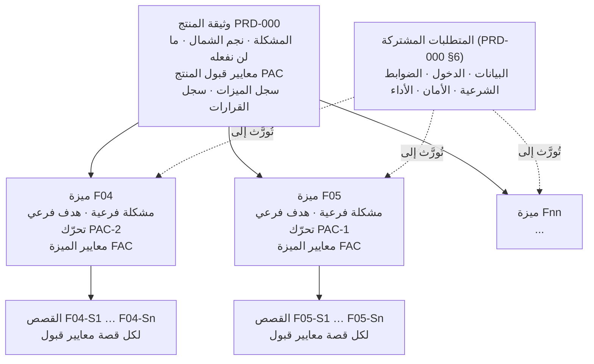

# دليل كتابة وثائق المتطلبات (PRD): نظام فريق رفيق

> **لمن هذا الدليل:** أعضاء الفريق، والوكلاء البرمجيون الذين يعملون معهم (Claude Code وغيره).
> **ما الذي يحكمه:** كل وثيقة متطلبات في هذا المستودع، من وثيقة المنتج الرئيسية إلى أصغر قصة مستخدم.
> **الحالة:** معتمد للاستخدام · آخر تحديث: 3 أكتوبر 2026

---

## الخلاصة

**كل وثيقة متطلبات عقدة في شجرة واحدة: هدف واحد للمنتج في الجذر، ووثائق الميزات فروعه، ومعايير قبول في كل مستوى. الفريق حرّ داخل الفرع، وملتزم عند الحدود.** قواعد ثابتة قليلة، وقرارات حرة كثيرة، وبوابات خفيفة تُبقي العمل سريعًا.

### القواعد الخمس

1. **جذر واحد.** كل وثيقة ترتبط بهدف المنتج الواحد. لا توجد وثيقة بلا أصل.
2. **معايير قبول في كل مستوى.** لوثيقة المنتج معايير على مستوى المنتج (PAC)، ولكل ميزة معايير على مستواها (FAC)، ولكل قصة معايير بصيغة: بافتراض / عندما / فإن.
3. **الأصل يحمل فروعه.** وثيقة المنتج تضم سجلًا حيًا بكل ميزة: هدفها الفرعي، ومالكها، وحالتها.
4. **المشترك يُكتب مرة واحدة في الأعلى.** نموذج البيانات، والدخول، والأمان، والأداء، وضوابط المحتوى الشرعي، كلها في وثيقة المنتج. وثائق الميزات تحيل إليها ولا تعيد تعريفها.
5. **المشكلة قبل الحل.** تبدأ كل وثيقة بمشكلة وهدف قابل للقياس قبل أي قصة.

### خريطة المستودع

| الملف | المحتوى |
| --- | --- |
| `docs/prd/00-guide.md` | هذا الدليل |
| `docs/prd/PRD-000-product.md` | وثيقة المنتج الرئيسية (الجذر)، وفيها سجل الميزات والمتطلبات المشتركة |
| `docs/prd/features/F04-knowledge-assistant.md` | **مثال** لوثيقة ميزة ذكاء اصطناعي (من بحث مسلّم العمير) |
| `docs/prd/features/F05-learning-progress.md` | **مثال** لوثيقة ميزة تجربة وتحفيز (من ملفات مهند الفوزان) |
| `docs/prd/templates/feature-prd.md` | قالب وثيقة الميزة |
| `docs/prd/templates/idea-card.md` | قالب بطاقة الفكرة |
| `AGENTS.md` و`CLAUDE.md` | قواعد الوكلاء البرمجيين |

---

## 1. هرم الوثائق

**وثيقة المنتج هي الجذر، وتحمل كل وثائق الميزات في سجلها؛ وكل ميزة تحمل قصصها؛ ولكل مستوى معايير قبوله.** ثلاثة مستويات تكفي.

تُقرأ من الأعلى إلى الأسفل: كل ميزة تسمّي معيار المنتج الذي تحرّكه، وكل قصة تحمل معاييرها، والمتطلبات المشتركة تسري على الجميع.

| طريقة حمل وثائق الميزات | متى | كيف |
| --- | --- | --- |
| داخل وثيقة واحدة | حتى خمس ميزات بمالك واحد | كل ميزة قسم داخل وثيقة المنتج |
| وثائق مرتبطة (**المعتمد في رفيق**) | أكثر من خمس ميزات أو عدة ملاك | كل ميزة ملف مستقل في `features/`، ولها سطر ورابط في السجل |

---

## 2. خطوات كتابة الوثيقة

**اكتب من الأعلى إلى الأسفل بهذا الترتيب ولا تقفز: القصة التي تُكتب قبل مشكلتها وهدفها لا يوجد ما تُقاس عليه.** الخطوات نفسها لوثيقة المنتج ولكل ميزة؛ يتغير النطاق فقط.

1. **حدّد الأصل.** سمِّ الوثيقة التي تخدمها ومعيار القبول (PAC) الذي تحرّكه. إن لم تجد أصلًا، فإما أنك تكتب وثيقة المنتج، وإما أن هذا النطاق لا ينتمي للمشروع.
2. **اكتب المشكلة** بهذه الصيغة: *[المستخدم] يصعب عليه [المهمة] لأن [السبب]، مما يكلّف [أثر قابل للقياس].* المشكلة لا تتضمن الحل.
   - على مستوى المنتج: الألم كله.
   - على مستوى الميزة: سبب واحد من أسباب ألم الأصل.
3. **حدّد الهدف.** مؤشر واحد، من خط أساس إلى مستهدف، بتاريخ. واذكر كيف يحرّك مؤشر الأصل. "إطلاق كذا" مُخرَج وليس هدفًا؛ "إتمام 75% من المختبِرين لدليل اليوم الأول" نتيجة وهدف.
4. **اكتب معايير قبول الوثيقة:** من ثلاثة إلى خمسة معايير قابلة للاختبار، تصف ما يراه المستخدم لا المهام البرمجية.
5. **اكتب ما لن نفعله** في هذه الدورة. أرخص أداة لضبط النطاق.
6. **اكتب قصص المستخدم:** *بصفتي [مستخدم]، أريد [فعلًا]، حتى [نتيجة].* قسّم القصص حسب خطوة سير العمل، أو دور المستخدم، أو نوع البيانات، أو المسار الناجح مقابل مسار الخطأ. لا تقسّمها حسب الطبقات التقنية أبدًا.
7. **اكتب معايير قبول كل قصة** بصيغة بافتراض / عندما / فإن، وتغطي: المسار الناجح، ومسار خطأ واحدًا على الأقل، والصلاحيات. لا تتقدم قصة بدونها.
8. **اكتب المتطلبات التقنية** الخاصة بهذه الوثيقة فقط: البيانات، والواجهات، والأمان، والأداء، والحجم. وأحِل إلى وثيقة المنتج في كل ما هو مشترك ولا تكرره.

**ثم افحص الحجم** بالجدول التالي.

### قواعد الحجم

| العلامة | وثيقة ميزة مستقلة | تُدمج في الأصل | تُقسَّم أكثر |
| --- | --- | --- | --- |
| الهدف | لها مؤشرها الخاص | لا مؤشر خاص بها | تخدم هدفين فأكثر |
| القصص | من 3 إلى 12 تقريبًا | قصة أو قصتان | 15 فأكثر |
| البيانات والواجهات | تملك كيانات أو عقدًا برمجيًا | تستخدم ما يملكه غيرها | تملك مجالات غير مترابطة |
| الإطلاق | يمكن إطلاقها وحدها | لا تُطلق إلا مع ميزة أخرى | أجزاؤها تُطلق في أوقات متباعدة |
| جملة المشكلة | جملة واحدة بلا "و" | — | تحتاج إلى "و" |

**مثال تطبيقي:** ملف التلعيب الذي كتبه مهند يضم التقدّم والسلسلة والأوسمة، والبطاقة اليومية والمكتبة، والتحديات الجماعية، والإشعارات. هذه أهداف مختلفة، فقُسّمت إلى ميزات: F05 (تقدّم التعلّم)، وF06 (البطاقة والمكتبة)، وF10 (التحديات الجماعية). أما الإشعارات فقواعدها مشتركة وتُكتب مرة واحدة في وثيقة المنتج.

---

## 3. من وثيقة المنتج إلى الميزات، دون كتابة وثائق كاملة

**لا تُكتب وثيقة ميزة كاملة إلا لما سيُبنى الآن. أي فكرة أخرى تكفيها بطاقة من خمسة أسطر وسطر في السجل.** بهذا تبقى الأفكار محفوظة، ويبقى الجهد على ما يُبنى.

### الخطوات

1. **ابدأ من مشكلة المنتج ومعاييره.** اقرأ القسمين 1 و3 في وثيقة المنتج.
2. **فكّك المشكلة إلى أسبابها.** مشكلة رفيق لها أسباب واضحة: العزلة، وحاجز اللغة، وتضارب المصادر، وغياب المتابعة والقياس.
3. **لكل سبب اسأل: ما الذي يحتاجه المستخدم ليتجاوزه؟** كل إجابة عنوان ميزة محتملة.
4. **اكتب سطرًا في سجل الميزات** (PRD-000 §5): المعرّف، والعنوان، والمشكلة الفرعية في سطر، ومؤشر الهدف الفرعي، ومعيار المنتج الذي تحرّكه، والمالك، والأولوية، والحالة = «فكرة».
5. **افحص الحجم** بالجدول السابق: هل هي ميزة مستقلة، أم جزء من ميزة أخرى، أم أكبر من ميزة؟
6. **اكتب بطاقة فكرة** بالقالب `templates/idea-card.md` إن احتاجت الفكرة إلى شرح أكثر من سطر.
7. **حين تُختار الميزة للبناء** تُكتب وثيقتها الكاملة بالقالب `templates/feature-prd.md`، ابتداءً من المثالين F04 وF05.

### أمثلة من السجل: عناوين بلا وثائق كاملة

| السبب في المشكلة | ما يحتاجه المستخدم | سطر السجل |
| --- | --- | --- |
| غياب المتابعة | أن يصل إلى إنسان حين يحتاج، وأن يتابعه مرشد | **F07 «أريد إنسانًا» ولوحة المرشد** — تحرّك PAC-2 |
| تضارب المصادر | محتوى معتمد مفهرس ومصطلحات موحّدة | **F08 خط المحتوى والمصادر والمعجم الموحّد** — تحرّك PAC-2 |
| العزلة | صحبة تشاركه لغته وتجربته | **F10 التحديات الجماعية التعاونية** — لاحقًا |
| غياب القياس | أن تعرف الجهة من يستمر ومن انقطع | **F11 حالات التفاعل ولوحة الجهة** — لاحقًا |
| الملل وضعف الاستمرار | تعلّم متجدد لا يتكرر | **F15 مولّد الألعاب والاختبارات من المصدر** — لاحقًا |

### مثالان لبطاقة الفكرة

**F07 «أريد إنسانًا» ولوحة المرشد**
- المشكلة: المسلم الجديد يحتاج إنسانًا في المسائل الشخصية والحالات الحرجة، ولا يعرف بمن يتصل.
- يحرّك: PAC-2 (الإحالة الصحيحة في الحالات الحرجة).
- الفكرة: زر ثابت يوصله بمرشد، ولوحة بسيطة يرى فيها المرشد الطلبات ويرد عليها.
- الوقت المقترح: يوم عمل واحد لنسخة الهاكاثون.
- أسئلة مفتوحة: من يقوم بدور المرشد أثناء العرض؟ وما أرقام المساعدة لكل بلد؟

**F15 مولّد الألعاب والاختبارات من المصدر**
- المشكلة: تكرار الدروس بالشكل نفسه يضعف عودة المستخدم.
- يحرّك: نجم الشمال (الاستمرار)، لاحقًا.
- الفكرة: يختار المستخدم موضوعًا، فيولّد النموذج من النص المعتمد المسترجَع لعبة (اختيار من متعدد، صح وخطأ، ترتيب خطوات) بصيغة JSON منظمة، مع المصدر.
- الوقت المقترح: بعد اكتمال F04 وF08.
- قيد: لا يولّد النموذج نصًا شرعيًا من عنده؛ يعمل على المسترجَع فقط.

---

## 4. القوالب

- **قالب وثيقة المنتج:** وثيقة المنتج نفسها (`PRD-000-product.md`) هي القالب المطبّق؛ لا توجد إلا وثيقة منتج واحدة.
- **قالب وثيقة الميزة:** `templates/feature-prd.md`. معظمها قصص ومعايير قبول ومتطلبات تقنية، تحت رأس قصير يربطها بالأصل.
- **قالب بطاقة الفكرة:** `templates/idea-card.md`. خمسة أسطر.

**عمود «تحرّك» هو ما يربط الشجرة:** كل ميزة يجب أن تسمّي معيار المنتج الذي تحرّكه. الميزة التي لا تحرّك شيئًا توسّع في النطاق.

**معرّفات القصص تحمل معرّف الميزة** (مثل F04-S3)، فتُتتبَّع أي قصة إلى ميزتها، ثم إلى معيار المنتج، ثم إلى نجم الشمال.

---

## 5. طريقة عمل الفريق

**أي عضو يقترح ميزة، ومالك واحد للجذر، وكل وثيقة تمر بالبوابات الخفيفة نفسها.**

### الأدوار

| الدور | يملك | يقرر | لا يقرر |
| --- | --- | --- | --- |
| مالك المنتج (ناصر بن عبدالعزيز العويمر) | وثيقة المنتج، ونجم الشمال، والسجل، والمتطلبات المشتركة | أي الميزات تُبنى في الدورة | كيف تُصمَّم الميزة أو تُبنى |
| مالك الميزة (أي عضو) | وثيقة ميزة واحدة من أولها إلى آخرها | القصص، وطريقة الحل، وتقليص النطاق ضمن الوقت المحدد | هدف الأصل أو القواعد المشتركة |
| المسؤول التقني | المتطلبات التقنية المشتركة | نموذج البيانات، وأعراف الواجهات، وأساس الأمان | أولوية الميزات |
| المراجع الشرعي (مهند بن صالح الفوزان) | اعتماد المحتوى الشرعي والمصادر | ما يُعرض للمستخدم من محتوى شرعي | التصميم التقني |

### دورة حياة الوثيقة

| الحالة | شرط الدخول | من ينقلها |
| --- | --- | --- |
| فكرة | بطاقة فكرة أو سطر في السجل | أي عضو |
| مسودة | مالك محدد، وبدأ القالب | مالك الميزة |
| جاهزة | اجتازت قائمة الجاهزية (في آخر الدليل) | مالك الميزة ومراجع واحد |
| ملتزم بها | اختيرت للدورة | مالك المنتج |
| قيد البناء | القصص في المتابعة مرتبطة بمعرّفاتها | الفريق |
| منجزة | تحققت معايير الميزة | مالك الميزة |
| متوقفة | استُبدلت أو أُلغيت، والقرار مسجّل | مالك المنتج |

### وضع الهاكاثون (4 إلى 6 أكتوبر 2026)

الإيقاع الأصلي (مراجعة أسبوعية ودورات من أسبوعين إلى ستة) لا يناسب ثلاثة أيام، فيُستبدل بما يلي:

| العنصر | في الهاكاثون |
| --- | --- |
| الدورة | من 4 إلى 6 أكتوبر |
| البوابة اليومية | تسجيل الدخول الساعة 9:00 صباحًا: نراجع السجل، ونلتزم بميزات اليوم، ونقلّص ما تأخر |
| الوقت المحدد للميزة | بالساعات، ويُكتب في وثيقة الميزة |
| المراجعة | مراجع واحد؛ وفي القرارات القابلة للتراجع يُعد الصمت ساعتين موافقة |
| تجاوز الوقت | يُقلَّص النطاق ولا يُمدَّد الوقت، وينتقل المقلَّص إلى بطاقة فكرة |
| الإغلاق | التسليم على المنصة قبل 11:59 مساءً يوم 6 أكتوبر، والهدف التسليم قبل ذلك بساعات |

---

## 6. الحدود: الثابت والحر

**ثبّت فقط ما يكلّف التراجع عنه، واترك كل ما يمكن التراجع عنه لمن يعمل.** القرارات التي لا رجعة فيها تحتاج مراجعة متأنية، والقابلة للتراجع تُتخذ بسرعة.

### الحدود الثابتة

| # | الحد | لماذا | من يغيّره |
| --- | --- | --- | --- |
| ح1 | لكل وثيقة أصل، وتسمّي معيار المنتج الذي تحرّكه | بدونه يتفتت الهدف المشترك | مالك المنتج |
| ح2 | لا تدخل قصة البناء دون معايير قبول تغطي المسار الناجح ومسار خطأ والصلاحيات | ما لا يُختبر لا يُعد منجزًا | لا أحد |
| ح3 | القواعد المشتركة (البيانات، والدخول، والواجهات، والأمان، والضوابط الشرعية) لا يُعاد تعريفها داخل ميزة | النسخ المتباينة تسبب أخطاء تكامل وأمان | المسؤول التقني في وثيقة المنتج |
| ح4 | نجم الشمال ومعايير المنتج لا تتغير أثناء الدورة | الهدف المتحرك يبطل كل الفروع | مالك المنتج، بين الدورات |
| ح5 | بعد الالتزام بالميزة، لا يدخل نطاق جديد إلا مقابل إخراج نطاق مساوٍ | يمنع تضخم النطاق بصمت | مالك الميزة ومالك المنتج |
| ح6 | القرارات التي لا رجعة فيها (نموذج البيانات، والواجهة العامة، والارتباط بمزود، والبيانات الشخصية) تُسجّل مع السبب والبدائل المرفوضة | مكلفة في التراجع | المسؤول التقني |
| ح7 | الضوابط الشرعية في PRD-000 §6.4 لا تُتجاوز لأجل أي ميزة | سلامة المحتوى مقدمة على الميزات | المراجع الشرعي ومالك المنتج معًا |

### المساحات الحرة (قرّر دون أن تستأذن)

- تصميم الحل والواجهة والتفاعل، ضمن المشكلة والهدف.
- طريقة تقسيم القصص وصياغتها، ما دام لكل قصة معايير قبول.
- تقليص النطاق ليناسب الوقت. التقليص ليس فشلًا.
- اختيارات التنفيذ الداخلية التي لا تمس القواعد المشتركة.
- اقتراح أي بطاقة فكرة، في أي وقت، من أي عضو.

---

## 7. أدوات الحماية

**ضع القواعد في القوالب والأدوات، لا في ذاكرة الناس ولا في الاجتماعات.**

| الأداة | تحمي | كيف |
| --- | --- | --- |
| حقول إلزامية في القالب | ح1، ح2 | «الأصل» و«تحرّك» ومعايير القبول لا تُترك فارغة؛ الفارغ ليس جاهزًا |
| قائمة الجاهزية | ح1، ح2، ح3 | تُجتاز قبل الالتزام بالميزة |
| المعرّف في كل مكان | ح1، ح2 | كل فرع والتزام وطلب دمج يحمل معرّف القصة (F04-S2)؛ ما لا يحمله لا يُراجَع |
| سجل الميزات | ح1، ح4 | جدول واحد في وثيقة المنتج؛ ما ليس فيه غير موجود |
| الوقت المحدد | ح5 | عند ضيق الوقت يُقلَّص النطاق ولا يُمدَّد الوقت |
| قاعدة التبادل | ح5 | إضافة قصة تتطلب ذكر القصة التي تخرج مقابلها في سجل القرارات |
| سجل القرارات | ح6 | كل قرار لا رجعة فيه يُسجَّل مع سببه والبدائل المرفوضة |
| `AGENTS.md` | ح3، ح7 | الوكلاء البرمجيون يقرؤون القواعد قبل أي تعديل |

---

## 8. حماية الإبداع والسرعة

**الأنظمة تقتل الإبداع حين تفرض الحل أو تثقل القرارات الصغيرة، وتحميه حين تثبّت المشكلة والهدف واختبار الإنجاز فقط.**

| ما يقتل الإبداع | علامته | العلاج في هذا النظام |
| --- | --- | --- |
| الوثيقة تفرض الحل | المطوّر "ينفّذ فقط" ولا تظهر بدائل | الوثيقة تثبّت المشكلة والهدف ومعايير القبول؛ الحل مساحة حرة |
| إجراءات ثقيلة لكل قرار | تتكدس الموافقات ويتوقف الاقتراح | المراجعة المتأنية للقرارات التي لا رجعة فيها فقط |
| أول فكرة تفوز | الحلول متشابهة كل مرة | قبل كتابة القصص، اذكر ثلاثة حلول بديلة على الأقل |
| حاجز عالٍ أمام الأفكار | تموت الأفكار في رؤوس أصحابها | بطاقة الفكرة خمسة أسطر، لأي عضو في أي وقت |
| قياس الوثائق | وثائق طويلة ونتائج قليلة | يُقاس الأثر على نجم الشمال، لا عدد الوثائق |

التوازن في سطر: **صارمون في «لماذا» و«متى ننتهي»، أحرار في «كيف».**

---

## 9. العمل مع الوكلاء البرمجيين

الوكيل البرمجي يكتب الكود ويساعد في صياغة الوثائق، لكنه لا يقرر النطاق ولا الضوابط.

1. **أعطِ الوكيل السياق:** `AGENTS.md` يُقرأ تلقائيًا، ثم أحِله إلى `PRD-000-product.md` وإلى وثيقة ميزتك.
2. **اطلب قصة واحدة بمعرّفها:** «نفّذ F04-S3 حسب معايير قبولها».
3. **لصياغة وثيقة ميزة من بطاقة فكرة:** اطلب من الوكيل أن يتبع هذا الدليل والقالب، وأن يستند إلى المثالين F04 وF05، وأن يضع ⚠️ على كل افتراض. ثم راجعها أنت قبل نقلها إلى «جاهزة».
4. **لا تقبل من الوكيل** إحصاءات أو مصادر لم تتحقق منها، أو قصصًا بلا معايير قبول، أو تعديلًا للقواعد المشتركة داخل ميزة.

### رموز الثقة في الوثائق

| الرمز | المعنى |
| --- | --- |
| ✅ | من مصدر مكتوب (وثيقة التحدي، ملف عضو، عرض الفكرة) |
| 💬 | قيل في محادثة الفريق |
| ⚠️ | استنتاج أو مقترح يحتاج تحققًا |

---

## 10. قوائم التحقق

### قائمة الجاهزية (قبل الالتزام)

- [ ] الأصل مرتبط، ومعيار المنتج (PAC) الذي تحرّكه مذكور
- [ ] المشكلة بالصيغة المعتمدة، ولا تتضمن حلًا
- [ ] الهدف مؤشر واحد بخط أساس ومستهدف وتاريخ
- [ ] معايير قبول الميزة مكتوبة (من 3 إلى 5، يراها المستخدم، قابلة للقياس)
- [ ] ما لن نفعله مذكور
- [ ] نوقشت ثلاثة حلول على الأقل، والاختيار مسجّل
- [ ] كل قصة إلزامية لها معايير قبول: مسار ناجح، ومسار خطأ، وصلاحيات
- [ ] المتطلبات التقنية مكتوبة، والمشترك مُحال إليه لا مكرر
- [ ] الاعتماديات مذكورة، ولا اعتمادية حاجبة ما زالت مسودة
- [ ] الحجم مناسب (من 3 إلى 12 قصة، وهدف واحد)
- [ ] الوقت المحدد مكتوب
- [ ] مسجّلة في سجل الميزات

### قائمة الإنجاز (قبل «منجزة»)

- [ ] كل القصص الإلزامية تجتاز معايير قبولها في بيئة اختبار
- [ ] معايير الميزة متحققة
- [ ] متطلبات الأمان والأداء متحققة
- [ ] أحداث القياس تعمل، فيمكن قياس الهدف الفرعي
- [ ] سجل القرارات وحالة الميزة في السجل محدّثان
- [ ] النطاق المقلَّص منقول إلى بطاقة فكرة، لا محذوف بصمت
